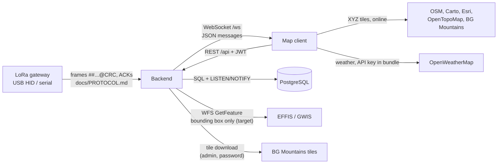

# API and integration contracts: Bee With Me

**Version:** 0.1 (Phase C)
**Status:** Draft
**Last updated:** 2026-10-03

Mutable supporting document. The live, exact contract is the OpenAPI page at `http://localhost:8000/docs`;
this page records the integration map, who may call what, and the message formats that OpenAPI does not
cover (WebSocket, `pg_notify`, hardware, external feeds). Update it with every endpoint or message change.

Access: **login** = any authenticated user (`get_current_user`); **admin** = `require_role('admin')`;
**none** = no authentication.

---

## 1. Integration map

---

## 2. REST endpoints (baseline 1.7.1)

| Area | Method and path | Access | Purpose |
|------|-----------------|--------|---------|
| Auth | `POST /api/auth/login` | none | Form login → access + refresh token |
| | `POST /api/auth/refresh` | refresh token | New tokens |
| | `GET /api/auth/me` | login | Current user |
| People | `GET /api/users/`, `GET /api/users/{id}` | login | List and detail, including personal data and the identification PIN (only admins log in) |
| | `POST /api/users/`, `PUT /api/users/{id}` | admin | Create, update |
| | `POST /api/users/{id}/photo` | admin | Upload photo to `/uploads` |
| | `POST /api/users/import` | admin | Excel import (`.xls`, `.xlsx`) |
| | `PATCH .../deactivate`, `PATCH .../reactivate`, `DELETE /api/users/{id}` | admin | Soft and hard delete |
| Teams | `GET /api/groups/`, `GET /api/groups/{id}` | login | List (optionally with members), detail |
| | `POST`, `PUT`, `PATCH deactivate/reactivate`, `DELETE` on `/api/groups/...` | admin | Manage teams |
| | `POST /api/groups/{id}/members`, `DELETE /api/groups/{id}/members/{user_id}` | admin | Membership, leader flag |
| Devices | `GET /api/devices/`, `GET /api/devices/{id}` | login | List, detail with assigned person |
| | `POST`, `PUT /api/devices/...`, `PUT /api/devices/{id}/assign` | admin | Register, update, assign or detach |
| | `DELETE /api/devices/{id}`, `POST .../reactivate`, `DELETE .../permanent` | admin | Deactivate; permanent delete removes positions and alerts |
| Positions | `GET /api/locations/live` | login | Latest position per device, last 24 h |
| | `GET /api/locations/trail?minutes=30` | login | Recent trails |
| | `GET /api/locations/{device_id}/history` | login | History of one device |
| SOS | `GET /api/locations/sos` | login | Open SOS alerts (restores the banner after reload) |
| | `POST /api/locations/sos/{id}/resolve?notes=` | login | Resolve; note optional (BR-08) |
| Export | `GET /api/export/csv`, `/geojson`, `/pdf` | login | Positions for a time range; no row cap yet |
| Tiles | `POST /api/tiles/bgmountains/download`, `GET .../status` | admin + password | Offline BG Mountains tiles |
| Reader | `GET /api/serial/status` | login | Reader state, last frame |
| Test | `POST /api/test/simulate`, `GET /api/test/devices` | admin, only if `ENABLE_TEST_ENDPOINTS` | Simulated frames |
| Health | `GET /health` | none | Liveness |
| Static | `/uploads/*` | **none** (R-09) | Photos |
| Static | `/tiles/bgmountains/*` | none | Offline tiles |

### 2.1 Target endpoints (EFFIS plan)

| Method and path | Access | Task |
|-----------------|--------|------|
| `GET /api/fire/hotspots`, `GET /api/fire/burnt-areas`, `GET /api/fire/status` | login | T10 |
| `GET`, `PUT /api/settings` (HQ, radii, switches) | read login, write admin | T12 |
| `GET /api/fire/alerts?state=open\|all`, `POST /api/fire/alerts/{id}/acknowledge`, `POST /api/fire/alerts/acknowledge-all` | login | T16 |
| Dismiss hotspot, suppression zones CRUD, field reports | admin / login (see plan) | T18 |

The plan is authoritative for exact paths and payloads; copy them here when each task is merged.

---

## 3. WebSocket `/ws`

Server → client only; the client may send text to keep the connection alive. **No authentication, by design**
([ADR 15](../decisions/0015-live-channel-open-by-design.md)); reachable only on loopback (ADR 12).
Every message is JSON with a `type`.

| `type` | Source channel | Payload | Status |
|--------|----------------|---------|--------|
| `location_update` | `pg_notify('location_update')` | `device_id`, `user_id`, `full_name`, `rank`, `photo_url`, **`phone`**, `mgrs`, `latitude`, `longitude`, `altitude_m`, `speed_knots`, `course_deg`, `battery_voltage`, `gnss_satellites`, `gnss_valid`, `sos_active`, `repeater_mode`, `recorded_at`, `received_at`, `groups[]` | Baseline (by design, ADR 15) |
| `sos_alert` | `pg_notify('sos_alert')` | `id`, `device_id`, `user_id`, `dev_sn`, `full_name`, `rank`, `triggered_at` | Baseline |
| `serial_status` | Direct broadcast by the reader | Reader state, last frame time, frame count | Baseline |
| `fire_data_updated` | `pg_notify('fire_data_updated')` | `fetched_at`, `hotspot_count`, `burnt_area_count`, `upstream_state` (`live`, `no_recent_detections`, `error`) | Target (T9) |
| `fire_alert`, `fire_alert_updated` | Fire alarm service | `FireAlertOut`: id, target type, device, person, hotspot, `distance_m`, times, resolve reason | Target (T15) |
| `fire_alert_repeat` | Fire alarm service | `alert_ids[]` (≤ 100) | Target (T15) |

`pg_notify` payloads are limited to 8000 bytes by PostgreSQL; payloads must stay small (IDs, not lists of
records).

---

## 4. Hardware interface

Authoritative: `docs/PROTOCOL.md`, pinned by `backend/tests/test_parser.py`. Summary: ASCII frames
`##...@CRC\r\n` spread over 64-byte HID packets (VID `0x0ACD`, PID `0xFAAF` by default, configurable); the
reader answers with ACKs. Changes require the hardware owner and a test on real hardware.

---

## 5. External feeds

| Feed | Called by | Sends | Receives | Failure behaviour |
|------|-----------|-------|----------|-------------------|
| EFFIS/GWIS WFS (target) | Backend poller, every 30 min | Bounding box, layer name | GeoJSON hotspots, burnt areas | Timeout and size limit; last good data kept with its age; state `error` (TP-02) |
| BG Mountains tiles | Backend, on admin request | Tile coordinates | PNG tiles stored locally | Download status shown |
| OSM, Carto, Esri, OpenTopoMap, BG Mountains | Browser | Tile coordinates (reveal the map area) | Tiles | Blank map when offline (R-04) |
| OpenWeatherMap | Browser | API key, map area | Weather tiles and data | Layer fails (R-05) |
| Wind data (target, first future integration) | Backend poller | Area of operation only | Wind speed and direction | Last known wind with its age (TP-02); source ⚠️ OpenWeatherMap or Open-Meteo |
| APRS, Meshtastic (future) | New readers | ⚠️ to be designed | Positions (and messages) | Must not block the RescuerBee path |
