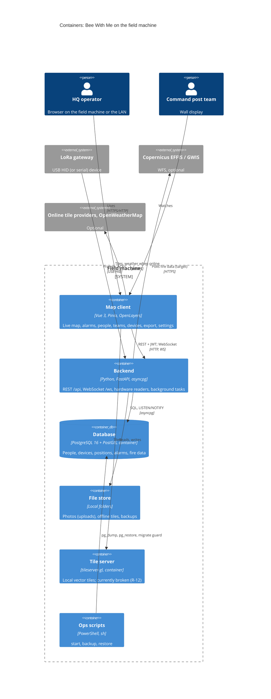
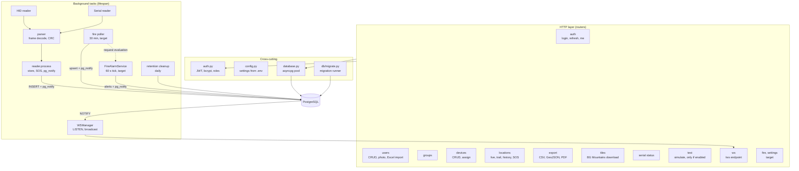
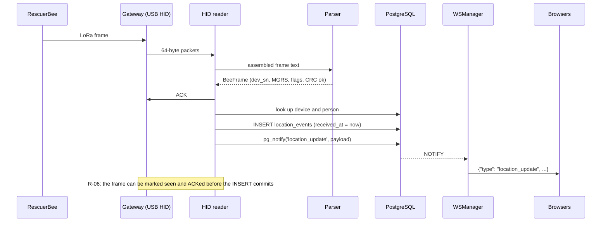
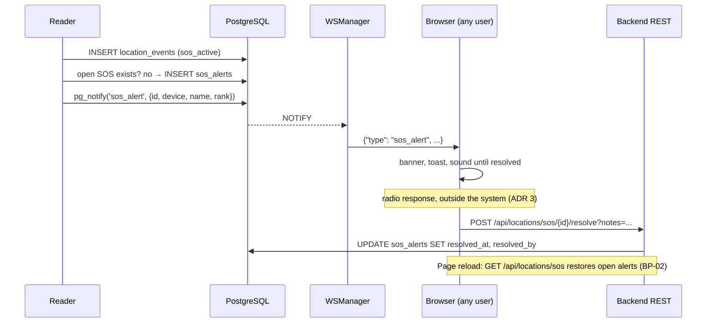

# Application architecture: Bee With Me

**Version:** 0.1 (Phase C)
**Status:** Draft
**Last updated:** 2026-10-03
**Describes:** version 1.7.1 on branch `feature/effis-fire-layers`; *target* marks components from the EFFIS
plan that are not written yet

Mutable supporting document. The stable summary is in
[Architecture.md, Section 4](../Architecture.md#4-phase-c-information-systems-architectures). Interfaces are in
[api-contracts.md](api-contracts.md).

---

## 1. Style

A **modular monolith on one machine** ([ADR 6](../decisions/0006-modular-monolith-in-process-tasks.md)): one
FastAPI process holds the REST API, the WebSocket endpoint and every background task (hardware readers,
notification listener, cleanup, and in the target the fire poller and fire alarm service). The database is
the integration point: writers insert and call `pg_notify`; one listener forwards notifications to browsers
([ADR 7](../decisions/0007-pg-notify-websocket-live-channel.md)). The browser runs a Vue single-page app
([ADR 9](../decisions/0009-vue-spa-openlayers.md)).

---

## 2. Containers (C4 level 2)



In development the map client is served by the Vite dev server on :5173 and the backend by uvicorn on
:8000 (R-11). Container layout and ports belong to Phase D.

---

## 3. Backend components (C4 level 3)



### 3.1 Component catalogue

| Component | Responsibility | Capabilities | Status |
|-----------|----------------|--------------|--------|
| `routers/auth` + `auth.py` | Login (form), JWT access 60 min and refresh 7 days, `get_current_user`, `require_role` | 6.1 | Baseline |
| `routers/users` | People CRUD, photo upload, Excel import (`.xls`, `.xlsx`) | 4.1 | Baseline |
| `routers/groups` | Teams and membership | 4.2 | Baseline |
| `routers/devices` | Device CRUD, assignment, deactivate, permanent delete with history | 4.3 | Baseline |
| `routers/locations` | Live positions (last 24 h), trails, history, open SOS, resolve | 1.1 to 1.3, 2.1, 2.3 | Baseline |
| `routers/export` | CSV, GeoJSON, PDF (WeasyPrint, URL fetching blocked) | 5.1 | Baseline |
| `routers/tiles` | Download BG Mountains tiles for offline use (password protected) | 1.4 | Baseline |
| `routers/hardware_reader` | Reader status | 1.1 | Baseline |
| `routers/test` | Simulated frames; mounted only with `ENABLE_TEST_ENDPOINTS=true` | (dev) | Baseline |
| `hardware_reader/hid_reader` | Read 64-byte HID packets, assemble frames, send ACKs | 1.1 | Baseline; changes need real hardware |
| `hardware_reader/reader` | Serial reader; shared frame processing: store position, open SOS, notify | 1.1, 2.1 | Baseline |
| `hardware_reader/parser` | Decode frames per `docs/PROTOCOL.md`, MGRS to lat/lon | 1.1 | Baseline |
| `ws.py` | LISTEN on notification channels with reconnect and health check; broadcast to every client | 1.1, 2.1 | Baseline |
| retention cleanup (`main.py`) | Delete old positions daily | 5.3 | Baseline (R-20) |
| `db/migrate.py` | Apply numbered migrations at start-up after a backup check | 6.3 | Baseline (EFFIS P0) |
| `fire/sources`, `fire/poller`, `fire/repository` | Bounded GWIS fetch, upsert, prune, `fire_data_updated` | 3.1 | Target (P1) |
| `fire/proximity`, `fire/service` | Pure distance checks; single alarm actor; alerts and repeats | 2.2, 2.4 | Target (P4, P5) |
| `routers/fire`, `routers/settings` | Fire data, alerts, acknowledge, zones, field reports, settings | 1.5, 2.2 to 2.4, 3.1, 5.2 | Target (P1 to P5) |

### 3.2 Frontend components

| Part | Responsibility |
|------|----------------|
| `views/` | Login, Map, Users, Groups, Devices, Export, About; target adds Settings |
| `components/` | `AppLayout`, `SOSBanner`, `SOSToast`; target adds fire alarm banner |
| `composables/useMap.js` | OpenLayers map, basemaps, layers, markers, trails |
| `composables/useWebSocket.js` | `/ws` connection, dispatch by message `type` to the store |
| `stores/auth.js`, `stores/locations.js` | Token and user; live positions, SOS, reader status |
| `api/client.js`, `api/index.js` | axios with refresh interceptor; one function per endpoint |
| `i18n/en.js`, `i18n/bg.js` | Every UI string in both languages |
| `router/` | Routes; redirects to `/login` without a token (no per-role routes) |

---

## 4. Key flows

### 4.1 Position frame to every screen



> ⚠️ **Requires technical clarification:** the exact order of ACK, dedupe and INSERT in `hid_reader` must be
> checked against real hardware (R-06, R-07). This diagram shows the intended order.

### 4.2 SOS raised and resolved



### 4.3 Fire data and fire alarm (target)

```mermaid
sequenceDiagram
    participant P as Fire poller (30 min)
    participant E as EFFIS/GWIS
    participant DB as PostgreSQL
    participant A as FireAlarmService (60 s)
    participant W as WSManager
    participant B as Browsers

    P->>E: WFS GetFeature (bounding box only)
    E-->>P: GeoJSON (bounded size, timeout)
    P->>DB: upsert hotspots, burnt areas; prune
    P->>DB: pg_notify('fire_data_updated')
    P-->>A: request evaluation
    A->>DB: load settings, rescuer positions, hotspots, zones, open alerts
    A->>A: haversine distances (pure)
    A->>DB: INSERT fire_alerts; pg_notify('fire_alert')
    DB-->>W: NOTIFY
    W->>B: fire_alert, then fire_alert_repeat until acknowledged
    B->>DB: POST /api/fire/alerts/{id}/acknowledge (via REST)
```

---

## 5. Authentication and authorisation

| Aspect | Baseline | Target |
|--------|----------|--------|
| Identity | Local accounts in `users` ([ADR 8](../decisions/0008-local-accounts-jwt.md)) | Unchanged |
| Tokens | JWT HS256: access 60 min, refresh 7 days; stored by the SPA | Unchanged |
| Roles | `admin` for all writes; reads need only a login | Admin-only deletes (BR-07) |
| `/ws` | **No authentication** (R-02) | Token on connect before multi-user use |
| `/uploads` | **No authentication** (R-09) | Served through an authenticated endpoint |
| CORS | `*` (R-03) | Local origins only |
| First login | Default `admin`/`admin` on an empty database (R-08) | Forced password change |
| `rescuer` vs `viewer` | No difference in the API today | ⚠️ owner: are these roles used? |

> ⚠️ **Requires stakeholder input (owner):** do `rescuer` and `viewer` accounts exist in practice, and should a
> `viewer` (for example a partner on the wall display) see blood types, phones and PINs? Today every logged-in
> user can read them (R-23).

---

## 6. Open technical questions

**Two gateway paths stay.** The owner confirmed (2026-10-03) that the serial reader stays alongside the USB
HID reader. Both share the frame processing in `hardware_reader/reader.py`.

> ⚠️ **Requires technical clarification:** both readers start at every boot. Decide whether one installation
> uses one gateway at a time (then start only the configured reader) or both at once (then a frame seen by
> both must be stored once). Validate with real hardware (R-24).

**Future integrations.** The owner confirmed (2026-10-03) that more integrations will come, **wind data first**
(wind-shift warnings, draft spec `docs/superpowers/specs/2026-10-02-wind-shift-alerts-design.md`), then
possibly APRS and Meshtastic. Each new source follows the fire-data pattern so it cannot hurt core tracking
(TP-02):

| Integration | Kind | Pattern to follow |
|-------------|------|-------------------|
| Wind data (OpenWeatherMap today, keyless Open-Meteo considered) | Online feed | Backend poller with timeout and size limit, stored with its age, `pg_notify` on change, last known value shown when the link drops; no API key in the browser (R-05) |
| APRS | Second position source (radio) | A new reader feeding the same frame processing and the same tables; device identity mapping decided in an ADR |
| Meshtastic | Second position and message source (LoRa mesh) | As APRS; may need a new device type |

> ⚠️ **Requires stakeholder input (owner):** order and scope of APRS and Meshtastic, and whether they need
> to send to devices (today the system only receives).
