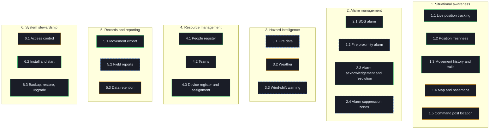
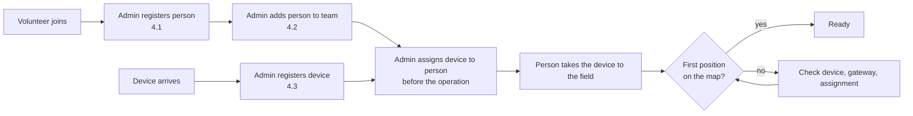
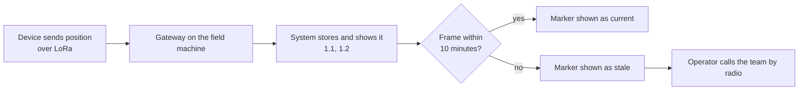
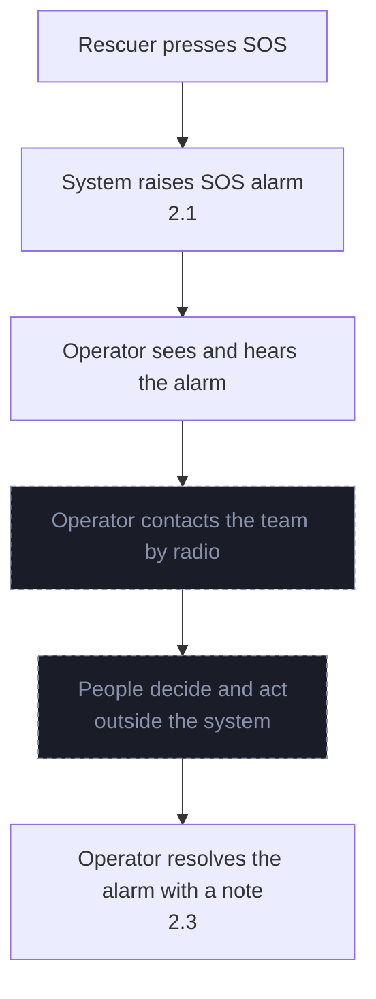
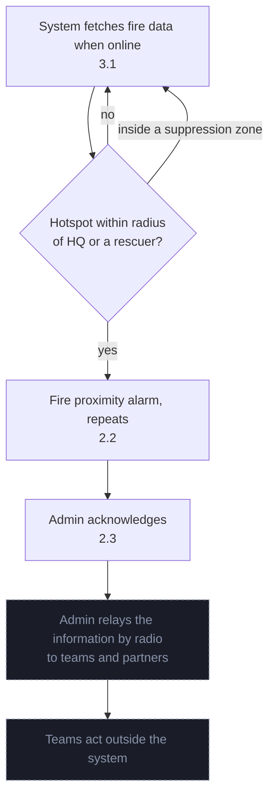

# Business architecture: Bee With Me

**Version:** 0.2 (Phase B, owner answers 2026-10-03)
**Status:** Draft (subject to change; approved by the owner when merged)
**Last updated:** 2026-10-03

Mutable supporting document for Phase B. The stable summary is in
[Architecture.md, Section 3](../Architecture.md#3-phase-b-business-architecture). Update this file in the same
pull request that adds, changes or retires a capability, rule or process.

---

## 1. Business scope

Bee With Me supports one business activity: **keeping track of people in the field during a rescue or
volunteer operation, and warning the command post when one of them needs help or a fire comes near.**

The rescue response itself (deciding who goes where, talking to teams, calling other services) is done by
people over radio and phone, outside the system ([ADR 3](../decisions/0003-alarm-response-outside-the-system.md)).
The system has no notion of an "operation" with a start and an end; one running installation serves
whatever operation is under way ([ADR 4](../decisions/0004-no-operation-entity.md)).

---

## 2. Capability map

Level 1 capabilities are stable; level 2 may change with the roadmap.

Legend: green = in baseline 1.7.1; amber = in baseline with a gap; blue dashed = target only.

### 2.1 Capability catalogue

| ID | Capability | Description | Baseline 1.7.1 | Target | Goals | Principles |
|----|-----------|-------------|----------------|--------|-------|------------|
| 1.1 | Live position tracking | Receive positions from RescuerBee devices (and repeaters) over LoRa and show them on every connected screen | ✅ | Unchanged | G-01 | BP-01, TP-01 |
| 1.2 | Position freshness | Show the age of every position; mark it stale after 10 minutes without a frame | ✅ | Unchanged | G-01 | BP-01 |
| 1.3 | Movement history and trails | Show where a person has been | ✅ | Trails fetched only for devices in view | G-01 | BP-01 |
| 1.4 | Map and basemaps | Show positions on a map the operator can read | ⚠️ only BG Mountains works offline | Every basemap the operator relies on has a local option | G-01 | TP-01 |
| 1.5 | Command post location | Mark HQ on the map; centre for fire proximity | ⚠️ per browser (localStorage) | Stored centrally, shared by all screens | G-03 | BP-02 |
| 2.1 | SOS alarm | Raise an alarm when a device sends SOS | ✅ | Unchanged | G-02 | BP-02 |
| 2.2 | Fire proximity alarm | Warn when an active fire is within a radius of HQ (10 km) or a rescuer (3 km) | ❌ | Repeats until acknowledged | G-03 | BP-02, TP-02 |
| 2.3 | Alarm acknowledgement and resolution | Any logged-in user acknowledges an alarm and resolves it, with an optional note; the record says who and when | ✅ SOS only | SOS and fire alarms | G-02 | BP-02 |
| 2.4 | Alarm suppression zones | Silence fire alarms for a known, controlled fire area | ❌ | Admin-defined zones | G-03 | BP-02 |
| 3.1 | Fire data | Burnt areas and active hotspots for the area of operation, with their age | ❌ | Copernicus EFFIS/GWIS, cached locally | G-03 | TP-02, BP-03 |
| 3.2 | Weather | Weather overlays on the map | ⚠️ online only, key in the browser | Optional, clearly online, key not in the browser | G-03 | TP-02, DP-01 |
| 3.3 | Wind-shift warning | Warn when the wind turns toward teams during a fire | ❌ | Draft spec | G-03 | BP-02, TP-02 |
| 4.1 | People register | Rescuers and volunteers with personal data (name, rank, blood type, phone, photo) | ✅ | Photos behind authentication | G-04 | DP-01, DP-02 |
| 4.2 | Teams | Group people into teams; show teams on the map | ✅ | Unchanged | G-01 | |
| 4.3 | Device register and assignment | Register devices and assign each to a person before an operation | ✅ | Unchanged | G-01 | BP-01 |
| 5.1 | Movement export | Export positions as CSV, GeoJSON or PDF | ✅ no row cap | Capped and streamed | G-05 | DP-02 |
| 5.2 | Field reports | Record what was seen in the field (for example a fire report) | ❌ | EFFIS plan P5 | G-03 | |
| 5.3 | Data retention | Keep operation data as long as required, then delete it | ⚠️ 90 days by default, keyed on the device clock; conflicts with BR-09 | Keyed on server receive time; period agreed with BR-09 | G-04 | DP-03 |
| 6.1 | Access control | Admins log in; live channel open by design on loopback (ADR 15) | ⚠️ default password | Forced password change, admin-only deletes | G-04 | DP-02 |
| 6.2 | Install and start | One start script on Windows or Linux | ✅ dev servers, manual start | Built release, restart after crash | G-05 | TP-03 |
| 6.3 | Backup, restore, upgrade | Backup before every migration; restore into a side database | ✅ | Restore tested before each release | G-05 | TP-03, BP-03 |

Goals G-01 to G-06 are defined in [Architecture.md, Section 2.2](../Architecture.md#22-business-drivers-and-goals).

---

## 3. Organisation and actors

| Actor | Type | Role in the business | Uses the system |
|-------|------|----------------------|-----------------|
| HQ operator (admin) | Internal | Runs the map, registers people and devices, receives alarms, relays them by radio | Yes, role `admin` |
| Command post team | Internal | Reads the wall display | Yes, read-only screen |
| Rescuer / volunteer | Internal | Carries a RescuerBee device, presses SOS, receives instructions by radio | No; appears on the map |
| ASP Rescuer Team | Organisation | Runs the operation | Through its operator |
| Partner organisations (any organisation, including state services such as the fire service and the military) | External | Take part in joint operations; receive information from the operator by radio or phone | ⚠️ see below |
| Copernicus EFFIS/GWIS | External system | Supplies fire data | Polled by the system when online |

Any organisation can take part in an operation, including state services such as the fire service and the
military (owner, 2026-10-03). Partners bring their own people, who may carry RescuerBee devices and be
registered in the people register.

> 📝 **Assumption:** partner organisations do not get their own accounts; at most they watch the wall
> display at the command post. Screens on other machines would need a new decision on network exposure
> (ADR 12, ADR 15), and data sharing with state services needs a lawful basis.

> ⚠️ **Requires stakeholder input (owner):** do partner organisations (especially the military) see the map
> or receive exports, and do they set rules on what may be stored about their people?

The operating organisation has **no data protection officer** (owner, 2026-10-03). Volunteers' personal data
is processed on the basis of their **contract with ASP**; no separate consent is needed (owner, 2026-10-04,
[ADR 16](../decisions/0016-lawful-basis-asp-contract.md)). That basis does **not** cover special categories
(GDPR Article 9): the people register holds blood types, which are health data.

Only admin accounts log in (owner, 2026-10-04). There are about ten RescuerBee devices in total, handed out to
some volunteers per operation, not one per person.

> ⚠️ **Requires stakeholder input (owner, with legal advice):** the lawful basis for blood type, and for
> registering partner personnel who are not under an ASP contract; who answers a request to see or delete a
> person's data. See R-19.

---

## 4. Business processes

### 4.1 Prepare: hand out devices (before an operation)

The admin is responsible for devices: registration, assignment before an operation, collection and
detachment after it (owner, 2026-10-03).

> ⚠️ **Requires stakeholder input (owner):** is the device check (battery, first fix) a formal step?

### 4.2 Track (during an operation)

### 4.3 Respond to SOS (as-is)

Detection is in the system; the response is people and radio, outside the system.

Any logged-in user may acknowledge and resolve an alarm; the note is optional (owner, 2026-10-03; matches
the code in 1.7.1).

### 4.4 Respond to a fire near HQ or a rescuer (target)

---

## 5. Business events

| Event | Trigger | Capability | Expected response |
|-------|---------|-----------|-------------------|
| Position received | Device frame reaches the gateway | 1.1 | Marker moves on every screen |
| Position goes stale | 10 minutes without a frame from a device | 1.2 | Marker marked stale; operator checks by radio |
| SOS raised | Device sends SOS | 2.1 | Alarm on every screen until resolved |
| SOS resolved | Operator resolves with a note | 2.3 | Alarm cleared; record keeps who and when |
| Fire data updated | Background fetch succeeds | 3.1 | Layers refresh with their age |
| Fire data unavailable | Fetch fails or no internet | 3.1 | Last good data shown with its age and an "unavailable" state |
| Fire near HQ or rescuer | Hotspot inside a radius, outside suppression zones | 2.2 | Repeating alarm until acknowledged |
| Device assigned | Admin links device and person before an operation | 4.3 | Positions shown under the person's name |
| Retention period passed | Daily cleanup | 5.3 | Old positions deleted |

---

## 6. Business rules

| ID | Rule | Source | Status |
|----|------|--------|--------|
| BR-01 | A position is stale after 10 minutes without a frame; freshness uses the server receive time. | BP-01, M-01 | In force |
| BR-02 | An SOS or fire alarm stays until a person acknowledges it; fire alarms repeat until then. | BP-02 | In force (SOS), target (fire) |
| BR-03 | Fire proximity radius: 10 km around HQ, 3 km around each rescuer; an admin can change them. | M-06 | Target |
| BR-04 | The admin assigns devices to people before an operation and collects and detaches them after it. | Owner, 2026-10-03 | In force (practice) |
| BR-05 | The response to an alarm is coordinated by radio, outside the system. | Owner, 2026-10-03; ADR 3 | In force |
| BR-06 | Position history is deleted after the retention period (90 days by default). | DP-03 | ⚠️ period to be confirmed |
| BR-07 | Only an admin may delete people, devices and data. | `todo.md` | Target |
| BR-08 | Any logged-in user may acknowledge or resolve an alarm; a note is optional. | Owner, 2026-10-03 | In force |
| BR-09 | Operation data must be preserved after the operation. | Owner, 2026-10-03 | ⚠️ how long and in what form |

BR-06 and BR-09 conflict today: the retention cleanup deletes positions after 90 days, while the owner
requires operation data to be kept (R-20). With no operation entity (ADR 4), keeping the data means either a
longer (or no) retention period, or an export archived outside the live database.

> ⚠️ **Requires stakeholder input (owner):** how long operation data must be kept, which data (positions,
> alarms, people as they were at the time), and in what form (live database, export file, backup).

---

## 7. Gap analysis

| Capability | Gap | Impact | Closed by |
|-----------|-----|--------|-----------|
| 1.4 Map and basemaps | Most basemaps need the internet | Blank or poor map in the field (R-04) | Phase E work package |
| 1.5 Command post location | Stored per browser | Screens disagree; fire alarm needs one HQ | EFFIS P3 |
| 2.2, 2.4 Fire alarm, suppression zones | Missing | Fire near teams not noticed in time | EFFIS P4, P5 |
| 2.3 Acknowledgement | SOS only | Fire alarms cannot be closed with a record | EFFIS P4 |
| 3.1 Fire data | Missing | No fire picture at the command post | EFFIS P1, P2 |
| 3.2 Weather | Online only; key and map centre leave the machine | DP-01 breach, no data offline (R-05) | Phase E |
| 3.3 Wind-shift warning | Missing | Late warning when fire turns | Draft spec |
| 4.1 People register | Photos served without authentication | Personal data leak (R-09) | Roadmap |
| 5.1 Movement export | No row cap | Export fails on large operations | Roadmap |
| 5.3 vs BR-09 | Retention deletes data the owner requires to keep | Operation record lost after 90 days (R-20) | Owner decision, then roadmap |
| 5.2 Field reports | Missing | Field observations not recorded | EFFIS P5 |
| 5.3 Data retention | Keyed on device clock; period not agreed | Data kept too long or deleted early (R-16) | Roadmap + owner decision |
| 6.1 Access control | Default password | First login with `admin`/`admin` (R-08) | Roadmap |
| 6.2 Install and start | Dev servers, no restart | Tracking stops after a crash (R-11) | Roadmap |
| Response record | Alarm response happens by radio; only a free-text note is stored | After-action review relies on memory | Accepted (ADR 3) |

---

## 8. Key performance indicators

There are no business KPIs (owner, 2026-10-03). The success measures M-01 to M-06 in
[Architecture.md, Section 2.7](../Architecture.md#27-success-measures) are the only measures.
