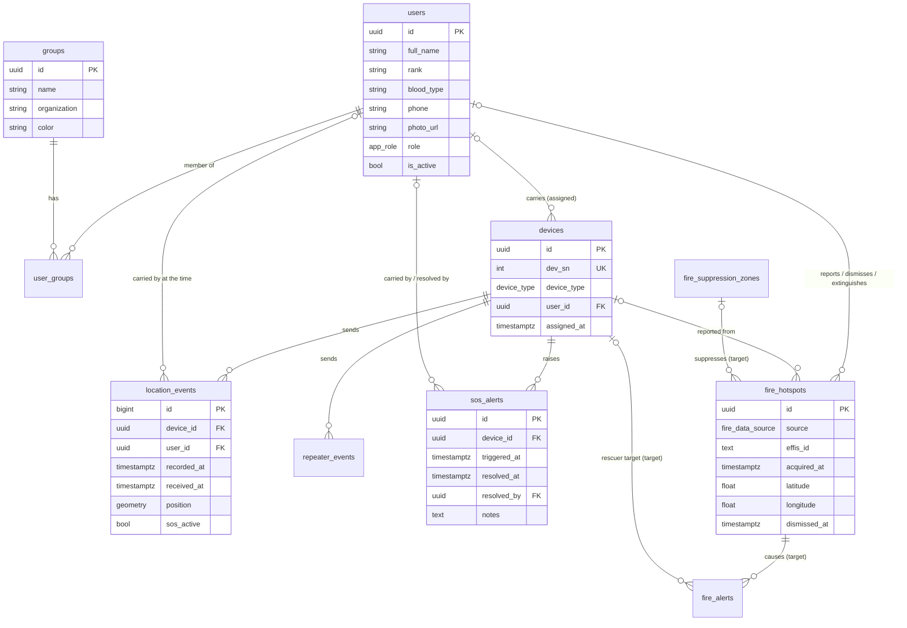

# Domain model: Bee With Me

**Version:** 0.1 (Phase C)
**Status:** Draft
**Last updated:** 2026-10-03
**Describes:** schema at migration `0002_fire_data` (branch `feature/effis-fire-layers`), plus the target tables
of the EFFIS plan (migrations `0003`, `0004`)

Mutable supporting document. Column-level detail is in [schema-core.md](schema-core.md) and
[schema-fire.md](schema-fire.md); classification and lifetime are in
[data-classification.md](data-classification.md). The source of truth for the schema is
`backend/db/migrations/` ([ADR 10](../decisions/0010-numbered-sql-migrations.md)); update this file in the
same pull request as a migration that changes an entity.

---

## 1. Entities

| Entity | Table | What it is | Created by | Capability |
|--------|-------|-----------|------------|------------|
| Person | `users` | A rescuer, volunteer or operator. Holds personal data and, for operators, login credentials and a role | Admin (form or Excel import); default `admin` on an empty database | 4.1, 6.1 |
| Team | `groups` | A team, optionally from a partner organisation, with a map colour | Admin | 4.2 |
| Team membership | `user_groups` | Person in team, with a leader flag | Admin | 4.2 |
| Device | `devices` | A RescuerBee (`bee`) or a repeater, identified by its serial number `dev_sn`; assigned to at most one person | Admin | 4.3 |
| Position | `location_events` | One position frame from a device: where, when (device clock and server clock), battery, SOS flag | Hardware reader | 1.1 to 1.3 |
| Repeater heartbeat | `repeater_events` | A frame from a repeater: battery and time | Hardware reader | 1.1 |
| SOS alert | `sos_alerts` | An SOS raised by a device; open until a person resolves it | Hardware reader; resolved by any logged-in user | 2.1, 2.3 |
| Fire hotspot | `fire_hotspots` | An active-fire detection (VIIRS, MODIS) from EFFIS, or a field report; can be dismissed or extinguished | Fire poller; field reports by a person | 3.1, 5.2 |
| Burnt area | `fire_burnt_areas` | A burnt-area polygon from EFFIS | Fire poller | 3.1 |
| Settings (target) | `settings` | Single row: HQ location, alarm radii, feature switches | Admin | 1.5, 2.2 |
| Fire alert (target) | `fire_alerts` | A fire within the radius of HQ or a rescuer; open until acknowledged and resolved | Fire alarm service | 2.2, 2.3 |
| Suppression zone (target) | `fire_suppression_zones` | A circle where fire alarms are silenced | Admin | 2.4 |

Not in the database: volunteer photos (files under `backend/uploads`, path in `users.photo_url`), offline
map tiles (files), backups (dump files), exports (files the operator saves).

There is no Operation entity ([ADR 4](../decisions/0004-no-operation-entity.md)).

---

## 2. Entity relationships

---

## 3. Key domain rules in the data

| Rule | Where it is enforced |
|------|----------------------|
| Freshness uses `received_at` (server clock), never `recorded_at` (device clock) (BR-01) | Queries and the WebSocket payload carry both; the UI judges on `received_at` |
| A position records the person who carried the device at that time (`location_events.user_id`), so reassigning a device does not rewrite history | Hardware reader at insert |
| At most one open SOS per device | Reader checks before insert; index `idx_sos_alerts_open` |
| A hotspot is unique per source and EFFIS id; a field report has no EFFIS id | `UNIQUE (source, effis_id)` and a `CHECK` |
| Deactivate before delete: people, teams and devices have `is_active`; permanent delete of a device also deletes its positions and alerts | Routers |
| Admin state of a hotspot (dismissed, notes, suppression) survives a feed refresh | Poller upsert leaves those columns out |

> ⚠️ **Requires technical clarification:** `location_events.latitude`, `longitude` and `mgrs` duplicate
> `position`; the roadmap proposes dropping them (`todo.md`). Decide before the table grows.

`users.pin` is the volunteer's identification PIN: an identifier, not a login secret (owner, 2026-10-04).
