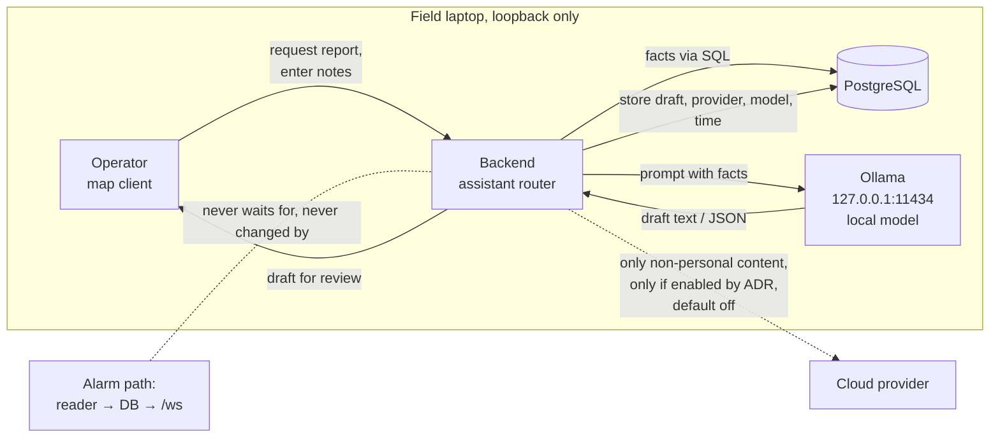

# FC-01: AI operator assistant (local first)

**Version:** 0.1
**Status:** Assessed (not decided; no ADR yet). Owner, 2026-10-04: **the system will not describe a
person's medical condition**, so medical triage is out of scope.
**Last updated:** 2026-10-04
**Source:** proposal "AI triage, local-first with optional cloud fallback" relayed by Kiril on 2026-10-04,
checked here against the principles, the ADRs and the code.

---

## 1. The proposal in short

Add an AI module to the backend: a provider abstraction with a **local model through Ollama** (for example
Qwen 2.5 7B/14B, Llama 3.2 3B, Phi-4, Mistral 7B) and an optional **cloud fallback** (OpenAI, Google Gemini,
Anthropic) when the local model does not answer and the internet is up. Proposed uses:

| Use | Input | Output |
|-----|-------|--------|
| SOS triage and priority | Text or voice message, telemetry (pulse, coordinates) | Priority code (RED/YELLOW/GREEN/BLACK, START/SALT), first steps |
| Smart dispatch | Incident position, volunteers (blood type, rank, equipment) | Suggested leader and team |
| Situation report (SitRep) | Position history, open SOS, event log | Text report for the command post |
| Voice field notes | Radio or phone audio (Whisper + LLM) | Structured fields filled in |

Integration points proposed: a `routers/triage.py` (`POST /api/triage/assess`, `POST /api/triage/dispatch-suggest`,
`GET /api/triage/sitrep`), a `triage_assessments` table, a WebSocket broadcast of the assessment on SOS, and an
"AI Triage Assistant" panel with operator confirmation (human in the loop).

---

## 2. Fit check

### 2.1 Inputs that do not exist today

| Proposed input | Reality | Consequence |
|----------------|---------|-------------|
| Text or voice SOS message from LoRa | RescuerBee frames carry position, time, battery and an **SOS bit only** (`docs/PROTOCOL.md`, Cmd=30). Devices cannot send text or audio. | Triage input can only come from the **operator**, typing or dictating what the rescuer said over the radio. |
| Telemetry (pulse) | Not in the frame, no sensor | Out of scope unless the hardware changes (hardware owner). |
| Volunteer equipment and skills | Not in the schema | Dispatch has nothing to match on except rank and position. |

### 2.2 Principles

| Principle | Finding | Verdict |
|-----------|---------|---------|
| **BP-02** Alarms win and persist | An AI priority must never raise, lower, hide, delay or clear an SOS or fire alarm. The alarm path (reader → database → `/ws`) must not wait for a model. | **Rule:** advisory only, outside the alarm path, computed after the alarm is shown. |
| **BP-01** Never lose a person | A model that ranks people "BLACK" or suggests who to send can steer attention away from someone. | Operator decides; the assistant never changes what the map shows. |
| **BP-03** Fail loud | Local inference may be slow or fail; a stale or missing assessment must look missing, not "GREEN". | Show "no assessment" explicitly; show the model and time on every answer. |
| **DP-01** Data stays on the machine | **Cloud fallback sends incident descriptions, names and positions to a third party.** A medical description is special-category data. | **Blocking** for personal data. Cloud use only for content with no personal data, and only after an ADR; default off. |
| **DP-02** Minimise and restrict | Dispatch using **blood type** relies on Article 9 data with no confirmed lawful basis (ADR 16, R-19). Medical assessments would be health data. | Do not use blood type. **No medical descriptions or assessments** (owner, 2026-10-04); assistant records hold operational facts only, restricted, with a lifetime (DP-03). |
| **DP-03** Explicit lifetime | New table of assessments | Needs a retention rule tied to BR-09. |
| **TP-01** No runtime internet | Local model works offline | Fine if the model is installed before deployment (models are 2 to 9 GB). |
| **TP-02** Online sources optional | Cloud fallback as an option | Fine only for non-personal content (see DP-01). |
| **TP-03** One machine, reproducible start | Ollama is one more service to install, start and update on Windows and Linux | Adds to the start scripts and the install guide. |

### 2.3 ADRs

| ADR | Effect |
|-----|--------|
| [ADR 3](../decisions/0003-alarm-response-outside-the-system.md) Alarm response outside the system | **Smart dispatch reopens it**: the system would start suggesting who goes where. Needs a superseding ADR, or dispatch stays out. |
| [ADR 6](../decisions/0006-modular-monolith-in-process-tasks.md) Modular monolith | A router plus a background task fits; Ollama is an external local process, like the database. |
| [ADR 12](../decisions/0012-loopback-only-network-exposure.md) Loopback only | Ollama must listen on `127.0.0.1:11434` only (its default). |
| [ADR 15](../decisions/0015-live-channel-open-by-design.md) Open `/ws` | Assistant output is not broadcast beyond an ID; the panel reads it through REST. |
| [ADR 16](../decisions/0016-lawful-basis-asp-contract.md) Lawful basis | Settled by the owner's rule: no medical descriptions, so no Article 9 data from the assistant. |

### 2.4 Field laptop

A typical laptop has no discrete GPU. A 7B model on CPU with 16 GB RAM answers in seconds to tens of seconds; a
3B model is faster but weaker in Bulgarian. **The proposed 3-second timeout before cloud fallback would almost
always fire on such a laptop**, so in practice personal data would go to the cloud. Inference also drains the
battery and competes with the backend for CPU.

> ⚠️ **Requires technical clarification:** measure answer time, RAM and battery use of 3B and 7B models on the
> actual field laptop before any design decision. Hardware options are assessed in
> [fc-01-ai-hardware.md](fc-01-ai-hardware.md): the current laptop may be enough for a report; if a purchase is
> needed, a rugged x86 laptop with an NVIDIA GPU fits the architecture best (Apple Silicon is excluded by ADR 2).

---

## 3. Ranking of the uses

| Use | Value | Fit | Recommendation |
|-----|-------|-----|----------------|
| **Situation report (SitRep)** from stored data: who is where, freshness, open and resolved alarms, fire data, for a time range | High: saves the operator writing reports; supports BR-09 (operation record) | Good: reads the database, no alarm path, can run local only | **First candidate.** Local model only. Facts (counts, times, positions) computed in SQL and given to the model; the model only writes prose. |
| **Voice field notes** (local speech-to-text + extraction) | Medium: hands-free logging of radio traffic | Fair: heavy on CPU; Bulgarian speech recognition quality to be tested | Later candidate; local only; operator reviews every extracted field. |
| **Medical triage** (START/SALT priority) | — | Excluded: the system does not describe medical conditions (owner, 2026-10-04); no device input | **Out of scope.** |
| **Smart dispatch** | Low with today's data | Poor: reopens ADR 3, uses blood type, no skills data | **Do not pursue** until ADR 3 is revisited and skills/equipment data exists. |

---

## 4. Target shape if pursued

Rules for any implementation:

1. **Advisory only.** No assistant output raises, ranks, silences or clears an alarm, or changes the map.
2. **Human in the loop.** Every output is a draft until the operator accepts or edits it; the record keeps both.
3. **Local by default.** The provider interface may have a cloud implementation, but it is off and refuses input
   that contains personal data. Enabling it needs an ADR (DP-01, TP-02).
4. **Facts from SQL, words from the model.** Numbers, times, names and positions come from queries and are
   checked against the output; the model does not compute them.
5. **Visible provenance.** Every output shows the model, the provider and the time; missing or failed output is
   shown as missing (BP-03).
6. **Data rules.** No medical descriptions in prompts, outputs or records (owner, 2026-10-04); prompts carry only
   operational facts; records are restricted, with a lifetime (DP-03), not broadcast on `/ws` beyond an ID
   (ADR 15). Voice notes must not be used to record a person's condition.
7. **Engineering standards.** Bounded calls with timeouts (ES-17), pure prompt building and output validation
   with an injected clock (ES-13), one writer for assistant records (ES-14).

### 4.1 Corrections to the proposed data model

The proposed `triage_assessments` table needs, if it is ever built:

- `location_event_id BIGINT` (the key of `location_events` is `BIGSERIAL`), or better a link to `sos_alerts.id`
  (UUID), since triage concerns an alert, not one frame;
- `uuid_generate_v7()` keys like the other new tables (ES-03, `0002_fire_data.sql`);
- `model`, `provider`, `input_text`, `output_json`, `accepted_by`, `accepted_at`, `operator_edit` columns;
- a numbered migration (ADR 10) and a retention rule.

### 4.2 Provider names

The proposal names models that are already dated (GPT-4o, Gemini 1.5 Flash, Claude 3.5). Model choice is an
implementation-time decision recorded in an ADR; the architecture only requires a provider interface, a local
default and the rules above.

---

## 5. Open questions

> ⚠️ **Requires stakeholder input (owner):** which use matters most to the operators: situation report or voice
> notes? The field exercise is a good place to ask.

> ⚠️ **Requires stakeholder input (owner):** may operational content without personal data (for example a
> report with names removed) ever go to a cloud provider, or is the assistant strictly local?

Settled (owner, 2026-10-04): the system does not describe a person's medical condition.

> ⚠️ **Requires technical clarification:** answer time and resource use of local models on the field laptop
> (Section 2.4); quality of Bulgarian output and of Bulgarian speech recognition.

## 6. Smallest useful next step

A throwaway prototype, outside the application: export one exercise's data (CSV), feed the facts to a local
model on the field laptop, and let the operator judge whether the generated situation report is useful and
correct. No change to the system, no personal data leaves the machine, and it answers the two technical
questions above.
