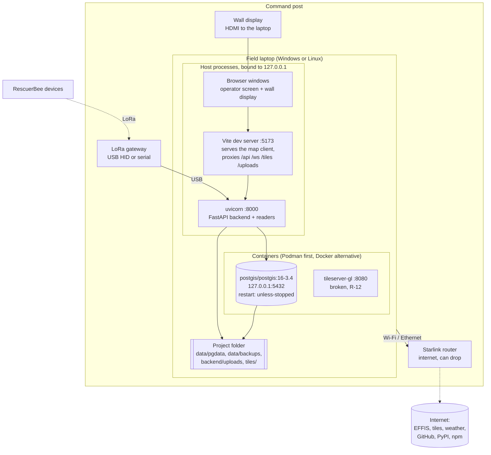

# Technology architecture: Bee With Me

**Version:** 0.1 (Phase D)
**Status:** Draft
**Last updated:** 2026-10-03

Mutable supporting document. The stable summary is in
[Architecture.md, Section 5](../Architecture.md#5-phase-d-technology-architecture). Update the catalogue in
the same pull request that adds, upgrades or removes a technology.

---

## 1. Field setup

Facts from the owner (2026-10-03):

- The field machine is a **typical laptop**, Windows or Linux.
- The **wall display is attached to the laptop** (second monitor); there are no other client machines.
- **Starlink is standard** at every operation and gives internet that can drop at any time.
- Updates arrive by **`git pull`** over that internet link.
- There is **no packaged release and no CI**; the system runs from source through the start scripts.

---

## 2. Technology catalogue

| Layer | Technology | Version in use | Pinned how | Decision |
|-------|-----------|----------------|------------|----------|
| OS | Windows 10/11 or Linux | | | [ADR 2](../decisions/0002-single-field-machine-intranet-deployment.md) |
| Container engine | Podman 6 (Windows: WSL machine) or Docker | | Engine picked by `CONTAINER_ENGINE` → `podman` → `docker` | [ADR 11](../decisions/0011-containers-for-infrastructure-host-for-app.md) |
| Database | PostgreSQL 16 + PostGIS 3.4 | `postgis/postgis:16-3.4` | Image tag | [ADR 5](../decisions/0005-postgresql-postgis-raw-sql.md) |
| Tile server | tileserver-gl | `latest` | **Not pinned** (R-12) | ⚠️ keep or remove |
| Backend runtime | Python | ≥ 3.11 (3.14 on the maintainer's machine) | `.venv` | |
| Web framework | FastAPI, uvicorn[standard] | ≥ 0.111, ≥ 0.29 | `requirements.txt` ranges | [ADR 6](../decisions/0006-modular-monolith-in-process-tasks.md) |
| DB driver | asyncpg | ≥ 0.29 | Range | ADR 5 |
| Settings | pydantic-settings, python-dotenv | | Range | [ADR 13](../decisions/0013-secrets-and-settings-in-env.md) |
| Auth | python-jose (HS256), bcrypt | | Range | [ADR 8](../decisions/0008-local-accounts-jwt.md) |
| Hardware | hidapi, pyserial-asyncio | | Range | |
| Geodesy | mgrs (Python and JS) | | Range | |
| Import | pandas, openpyxl, xlrd, python-calamine | | Range | |
| PDF | WeasyPrint | ≥ 70, < 71 | Range; needs GTK/Pango on Windows (R-10) | |
| Tests (backend) | pytest, pytest-asyncio, httpx | | Range | [engineering-standards.md](engineering-standards.md) |
| Frontend runtime | Node.js | 25 on the maintainer's machine | ⚠️ no `engines` field | |
| Frontend | Vue 3, Pinia, vue-router, vue-i18n, axios, OpenLayers 10 | | `package-lock.json` | [ADR 9](../decisions/0009-vue-spa-openlayers.md) |
| Build and dev server | Vite 5 | | Lock file | |
| Tests (frontend) | Vitest, @vue/test-utils, jsdom | | Lock file | |
| Ops scripts | PowerShell 5.1+/7, POSIX sh (Git Bash on Windows) | | In repo | ADR 11 |
| Source control | Git, GitHub (fork → owner's repository) | | | [ADR 14](../decisions/0014-run-from-source-git-pull.md) |

> ⚠️ **Requires technical clarification:** `requirements.txt` uses `>=` ranges, so a `git pull` followed by
> `pip install` in the field can pull new major versions (R-25). Consider a constraints file for the field.

---

## 3. Network and ports

| Listener | Address | Who connects | Set where |
|----------|---------|--------------|-----------|
| Vite dev server | `localhost:5173` | Browsers on the laptop | Vite default |
| Backend (uvicorn) | `127.0.0.1:8000` | Vite proxy, browsers on the laptop | uvicorn default (no `--host`) |
| PostgreSQL | `127.0.0.1:5432` | Backend, scripts | Compose (`ports` or Podman host network with `listen_addresses=127.0.0.1`) |
| tileserver-gl | `127.0.0.1:8080` | Browser | Compose |

Everything listens on loopback ([ADR 12](../decisions/0012-loopback-only-network-exposure.md)). With Starlink
on the same laptop, this is what keeps the system unreachable from the Starlink network. Outbound traffic
goes to EFFIS (backend, target), tile and weather providers (browser), and GitHub, PyPI and npm during
updates.

---

## 4. Operations

| Activity | How today | Gap |
|----------|-----------|-----|
| Install | Clone; create `.venv`; `pip install -r backend/requirements.txt`; `.env` from `.env.example`; `start.ps1` runs `npm install` on first start | Needs internet once; WeasyPrint runtime on Windows (R-10) |
| Start | `start.ps1` / `start.sh`: container engine check, db container, wait for Postgres, migration status, **backup if migrations are pending**, then uvicorn and Vite in their own windows | Dev servers, no auto-restart (R-11) |
| Upgrade | `git pull` over Starlink, then start (migrations after a backup) | Dependency ranges (R-25); no tagged releases in the field |
| Backup | `scripts/backup.ps1|sh`: `pg_dump -Fc` inside the container, checked with `pg_restore -l`, pruned by count, folder kept private; automatic before migrations | ⚠️ No periodic backup during an operation; same disk as the data |
| Restore | `scripts/restore.ps1|sh`: restore into a side database, then swap; previous database kept (R-14) | Not rehearsed on a spare machine |
| Monitoring | Console windows, `/health`, reader status in the UI, `pg_notify` listener reconnect | No log files kept; no alert when the backend dies |

### 4.1 Availability and recovery

> ⚠️ **Requires stakeholder input (owner):** recovery time (RTO) and acceptable data loss (RPO) when the laptop
> fails during an operation are not defined, and there is no spare laptop (R-01).
>
> **Proposal to discuss** (not decided): a spare laptop prepared from the same commit; a backup every 30 to 60
> minutes during an operation to a USB drive (not the laptop's own disk); a restore drill before each season.
> Each needs an owner decision and then an ADR.

The database container restarts by itself (`restart: unless-stopped`); the backend and the map client do not.
Positions sent while the backend is down are lost unless the gateway or device buffers and retransmits them
(⚠️ to be confirmed with the hardware owner).

---

## 5. Observability

| Signal | Where | Notes |
|--------|-------|-------|
| Backend log | uvicorn console window | `logger` with %-style arguments; no file, no rotation |
| Reader health | `serial_status` WebSocket message, `/api/serial/status` | Last frame time, frame count |
| Live channel | `ws.py` reconnect and health check every 30 s | |
| Fire feed (target) | `GET /api/fire/status`, `fire_data_updated` | Last success, last error, upstream state |
| Liveness | `GET /health` | Returns `ok`; does not check the database |

> ⚠️ **Requires technical clarification:** persisting logs to a rotating file would help after-the-fact
> analysis; it must follow DP-02 (no names, phones or positions in logs).
